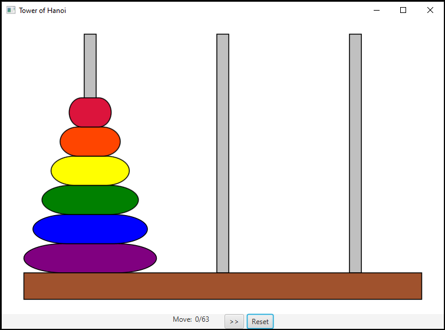

# Lab 10 - UI with JavaFX
*Note: For JavaFX installation instructions, please reference your Project 4 repository.*
## Overview
* Recall the **Tower of Hanoi** problem from our recursion problem set. This program is a graphical demonstration of the step-by-step solution to this problem.

* UI programs are mechanically more complex than the other programs we've worked with, involving lots of fun things like **multi-threading** and **asynchronous event queues**. These are great coffee topics, but they are not important for our course and will likely be covered in a future course.
* In order to avoid thread-related issues, UI programs must be designed properly. To avoid having to fully explain this, while still creating a valuable learning experience with a more complicated codebase, most of the code for this assignment has already been written.

### UI/UX Design - MVC
* The above-mentioned design is a lite version of the MVC (model, view, controller) design pattern. This pattern addresses issues that occur when threads other than the UI thread (event threads, user-spawned threads, or even the main thread) try to update interface components asynchronously from the UI thread. This can cause values to change in the middle of rendering and generally cause a mess.
* This project separates the program into a model and view. The model is responsible for holding/updating the UI objects' data, while the view is responsible for updating the graphical components with that data.

## Lab Objectives
* You will be required to modify several of the classes. All areas with required changes are marked with `TODO` comments, which can be viewed in the `Tasks` panel in eclipse.
* Note: these objectives are not listed in order of relative complexity, but none are particularly challenging. To get the program to run do the btnGo listener first.

### 0. `TowerOfHanoi.solve` Solution (20%)
* Your solution from the recursion lab will be used for this lab as well. For this reason, the JUnit test file `SolveTowerTest.java` has been included.
* If you did not write a solution for TowerOfHanoi in Lab 9, you will want to do this first.

### 1. Drawing Game Components (30%)
* In TowerOfHanoiView.java, you'll implement the `draw()` method.
* In TowerOfHanoiSetupView.java, you'll implement part of `TOH_Model.updateView()`.
* ***Note***: if you are changing parts of the game state, but the UI is not updating, make sure that you are calling the appropriate method(s) to re-draw the game components. This has to be done after ***any*** change to the model's data.

### 2. Listeners (50%)
* UI development revolves around the use of `Event`s and `Handler`s (aka `Action`s and `Listener`s) but the simplest is a button's activation handler. In `TowerOfHanoiSetupView.java` you'll be required to write the handler code for `btnForward` and `btnGo`.
* `btnGo` - This code must validate all user input from the settings window before starting the simulation. If any of the input is invalid, an `Alert` of the error type should pop-up with the proper error message.  
*NOTEs: as a hint, we have provided the required error messages as constants. Please see your textbook for more information on the `Alert` API.*
* `btnForward` - This event handler uses methods within `TOH_Model` to show the next step of the game's solution.

## Grading
* There is a zyLab submission containing the TowerOfHanoi unit tests. Your code will need to pass this to get full credit.
* After the deadline, we will manually grade submissions, making sure that all required functionality exists. A rubric is visible on Canvas.
