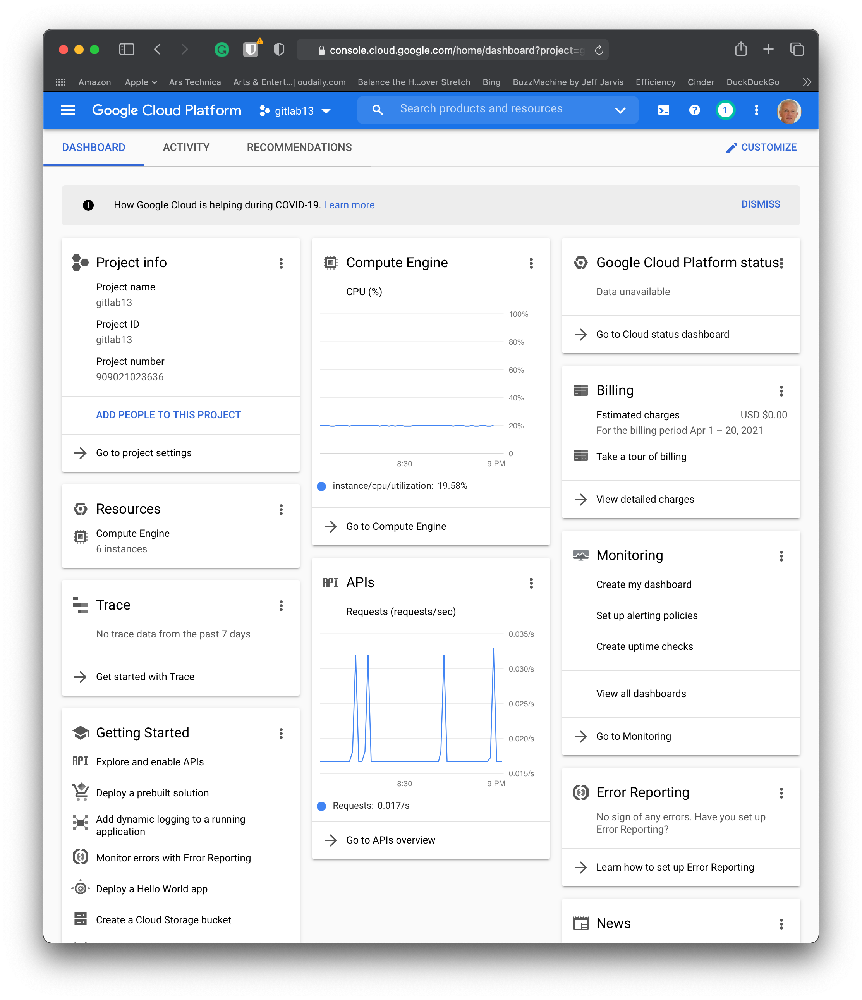
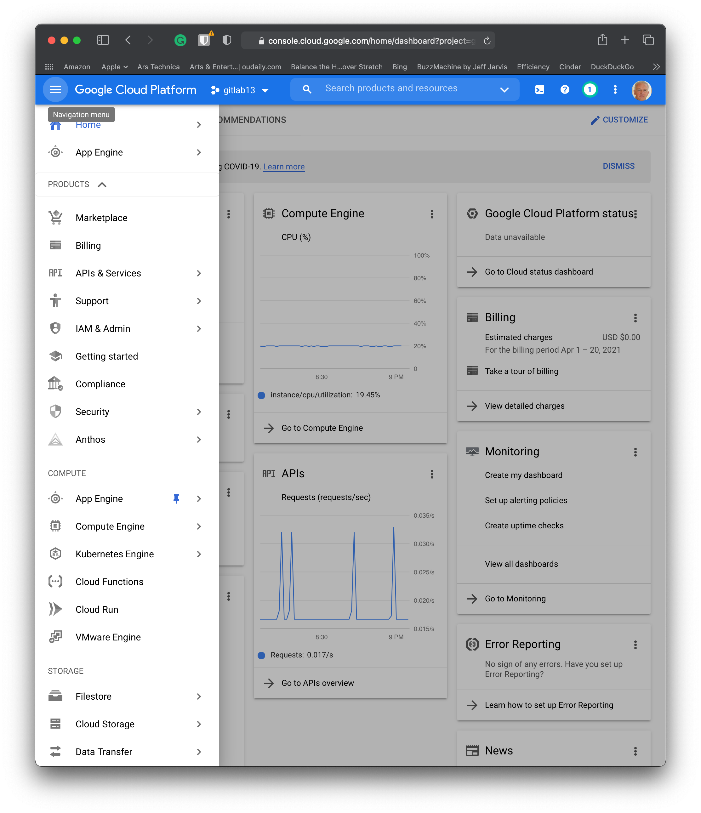
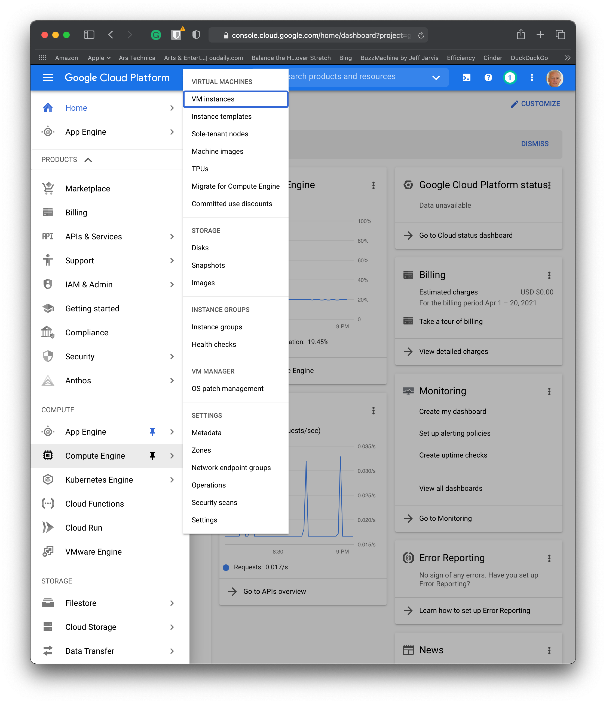
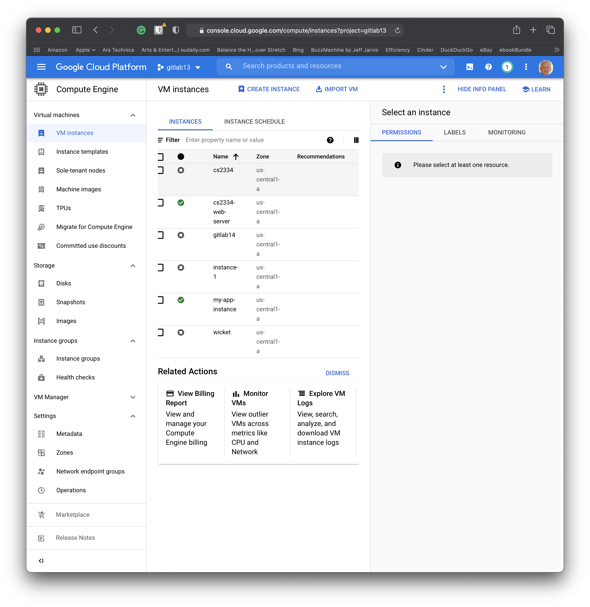
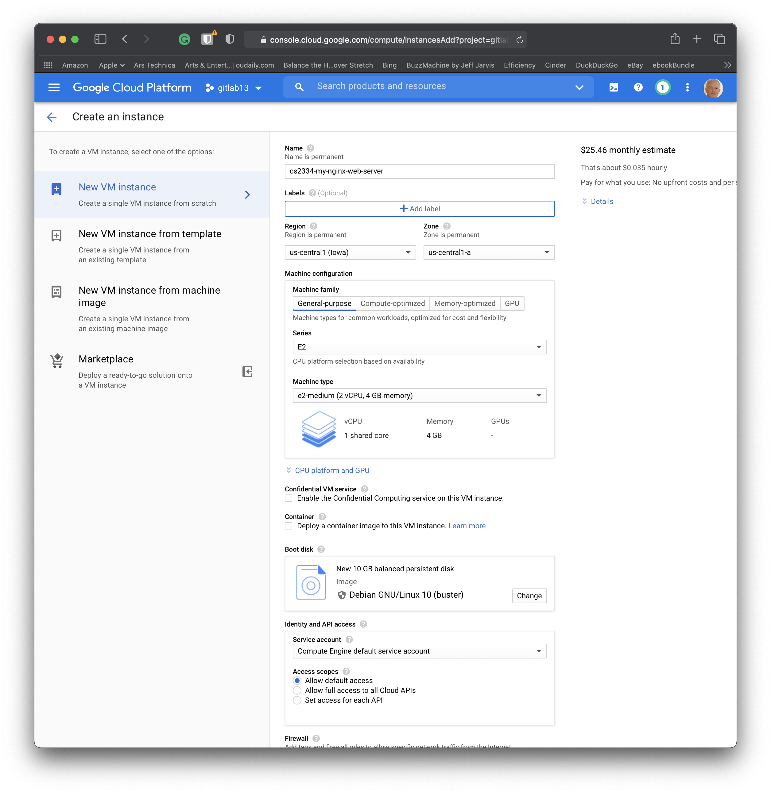
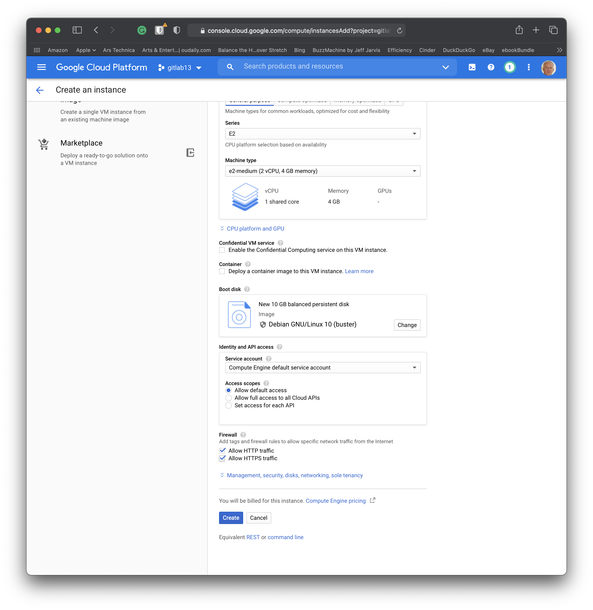
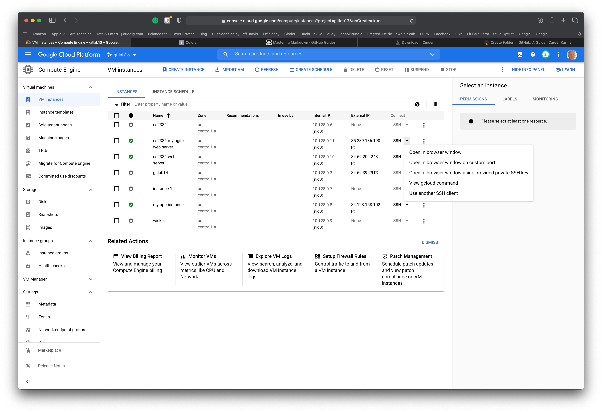

# Create a project and add it to your account

# Create your virtual machine

Look at 
[GCP REGION  picker](https://googlecloudplatform.github.io/region-picker/ "How to choose your region?").
Think about cost and energy production needed for your server to run.

These are the steps to be followed that will help you to create your virtual machine.

## Create your virtual machine

## Go to the burger menu in the upper left corner

## Choose the Compute Engine and select Virtual Machines -> VM Instances

## Choose "create instance" on the upper menu bar

## Create a Name for Your Instance

## Allow http and https
This is under Firewall section

## SSH to your instance -> in the Connect column

Choose an option to open in browser window

