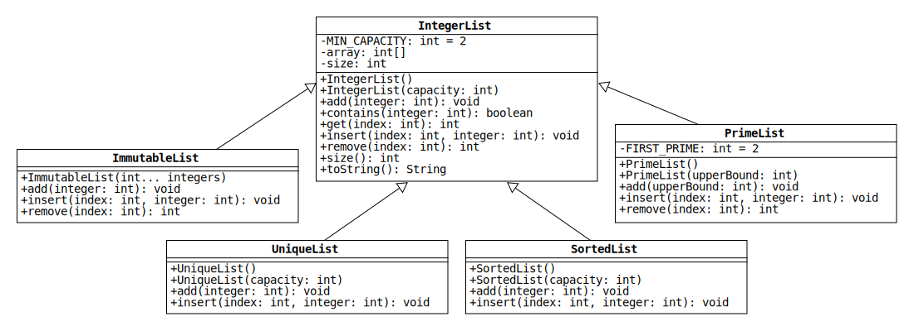

# Lab 5: Inheritance with Lists

In object-oriented programming, inheritance allows an existing class to be "extended" to create specialized subclasses.
We call each subclass a "derived" or "child" class and the existing class the "parent" class.

In this lab, you are given starter code for the parent class **IntegerList**.
Your goal is to complete this class and then implement four subclasses: **ImmutableList**, **UniqueList**, **SortedList**, and **PrimeList**.
Each subclass modifies the behavior of IntegerList in a different way.

## Class Diagram

Inheritance is represented in UML diagrams by an arrow that connects two classes.
The arrow points from the child class to the parent class.
The following is a UML diagram for IntegerList and its child classes:



Notice that each child class has methods with the same signature and return type as IntegerList.
This indicates that the child classes [override](https://docs.oracle.com/javase/tutorial/java/IandI/override.html) the parent class methods.
All of the behavior of the child classes should be implemented this way.
(Do not add any fields or methods to the classes that are not shown in the diagram.)

## IntegerList Class

This class is a [dynamic array](https://en.wikipedia.org/wiki/Dynamic_array) of integers.
Its behavior is very similar to `ArrayList<Integer>`.
All of the methods have been written for you except those listed below.
See the Javadoc comments for more information.

* `IntegerList(int)`
* `contains(int)`
* `get(int)`
* `toString()`

## ImmutableList Class

Objects of this subclass cannot be modified after they are created.
In order to implement this behavior, override each IntegerList mutator method so that it throws an UnsupportedOperationException.

To implement the constructor, call the IntegerList version of the insert method to add the given integers to the list.
The IntegerList add method seems like a more convenient choice, but you won't be able to use it.
Can you figure out why?
(This is a good test of how well you understand polymorphism.)

## UniqueList Class

This subclass does not allow duplicate integers to be added to the list.

* `UniqueList()`: Call the parent constructor to create an empty list with an initial capacity of MIN_CAPACITY.

* `UniqueList(int)`: Call the parent constructor to create an empty list with the given capacity.

* `add(int)`: Check whether the given integer is already in the list before appending it.
If so, throw an IllegalArgumentException with the message shown in the unit tests.

* `insert(int, int)`: Check whether the given integer is already in the list before inserting it.
If so, throw an IllegalArgumentException with the message shown in the unit tests.

## SortedList Class

This subclass adds integers to the list in ascending sorted order.

* `SortedList()`: Call the parent constructor to create an empty list with an initial capacity of MIN_CAPACITY.

* `SortedList(int)`: Call the parent constructor to create an empty list with the given capacity.

* `add(int)`: Insert the integer in the list at the position that maintains the sorted order.

* `insert(int, int)`: Throw an UnsupportedOperationException to disable this method.
That way, users of the class cannot insert integers at arbitrary positions in the list.

## PrimeList Class

This subclass behaves quite differently from the parent class.
Rather than add integers one-by-one, the user supplies an upper bound, and the resulting list contains all of the [prime numbers](https://en.wikipedia.org/wiki/Prime_number) that are less than or equal to this value.

* `PrimeList()`: Call the parent constructor to create an empty list with an initial capacity of MIN_CAPACITY.

* `PrimeList(int)`: Construct a list that contains all the prime numbers less than or equal to the given upper bound in ascending order.
If the upper bound is not positive, throw an IllegalArgumentException with the message shown in the unit tests.

* `add(int)`: Add all the prime numbers greater than the last prime in the list and less than or equal to the given upper bound (in ascending order).
If the list is empty and the upper bound is less than `FIRST_PRIME`, throw an IllegalArgumentException with this message:

  ```java
  "The upper bound cannot be less than 2."
  ```
  
  If the upper bound is less than or equal to the last prime in the list, throw an IllegalArgumentException with this message:

  ```java
  "The upper bound must be greater than the last prime in the list: <last-prime>."
  ```

  (Replace `"<last-prime>"` in the message with the last integer in the list.)

  To determine whether each integer in the specified range is prime, note the following: *An integer is prime if and only if it is not divisible by any smaller prime.*

* `insert(int, int)`: Throw an UnsupportedOperationException to disable this method.

* `remove(int)`: Remove all of the integers with indices greater than or equal to the given index.
If the index is out of bounds, throw the same exception that is thrown by the parent method.
