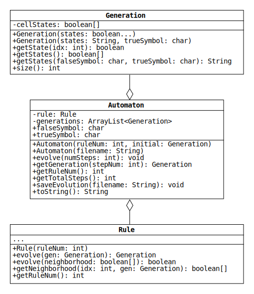

# Project 1: A Simple Program with Complex Behavior

> Over and over again we will see the same kind of thing: that even though the underlying rules for a system are simple, and even though the system is started from simple initial conditions, the behavior that the system shows can nevertheless be highly complex.
> And I will argue that it is this basic phenomenon that is ultimately responsible for most of the complexity that we see in nature.
>
> &mdash;Stephen Wolfram, in [*A New Kind of Science*](https://www.wolframscience.com/nks/)

## Introduction

Imagine a row of equal-sized squares.
Let some be colored white and the others black.
For example, here is one possible row:

```text
⬜⬜⬜⬜⬜⬜⬜⬛⬜⬜⬜⬜⬜⬜⬜
```

Suppose that after some time, the colors can change.
The new color of each square is determined by its current color and the colors of its left and right neighbors.
If exactly one of these squares is black, the new color is black.
Otherwise, the new color is white.

This rule can be expressed graphically with the following table:

|⬛⬛⬛|⬛⬛⬜|⬛⬜⬛|⬛⬜⬜|⬜⬛⬛|⬜⬛⬜|⬜⬜⬛|⬜⬜⬜|
|:-:|:-:|:-:|:-:|:-:|:-:|:-:|:-:|
| ⬜ | ⬜ | ⬜ | ⬛ | ⬜ | ⬛ | ⬛ | ⬜ |

The top row of each column shows one of the eight configurations of a square and its neighbors.
The bottom row shows the new color of the center square.

For instance, the rightmost column shows a white square with two white neighbors.
The rule says that the new color of the center square will be white.
The second-rightmost column shows a white square with a white left neighbor and a black right neighbor.
The rule says the new color will be black.

If we apply this rule to the entire row of squares, we get the following new colors:

```text
⬜⬜⬜⬜⬜⬜⬛⬛⬛⬜⬜⬜⬜⬜⬜
```

The center square remained black because both of its neighbors were white.
Meanwhile, its neighbors flipped from white to black because they each had a single black neighbor.

What kind of behavior will this system exhibit if we apply the rule multiple times?
To visualize how it changes, we can show the new colors on a new line.
Below is how the system evolves when the rule is applied seven times:

```text
0. ⬜⬜⬜⬜⬜⬜⬜⬛⬜⬜⬜⬜⬜⬜⬜
1. ⬜⬜⬜⬜⬜⬜⬛⬛⬛⬜⬜⬜⬜⬜⬜
2. ⬜⬜⬜⬜⬜⬛⬜⬜⬜⬛⬜⬜⬜⬜⬜
3. ⬜⬜⬜⬜⬛⬛⬛⬜⬛⬛⬛⬜⬜⬜⬜
4. ⬜⬜⬜⬛⬜⬜⬜⬜⬜⬜⬜⬛⬜⬜⬜
5. ⬜⬜⬛⬛⬛⬜⬜⬜⬜⬜⬛⬛⬛⬜⬜
6. ⬜⬛⬜⬜⬜⬛⬜⬜⬜⬛⬜⬜⬜⬛⬜
7. ⬛⬛⬛⬜⬛⬛⬛⬜⬛⬛⬛⬜⬛⬛⬛
```

This rule and initial row evidently produce a fractal pattern!

## Elementary Cellular Automata

The system described above is an example of an [elementary cellular automaton](https://en.wikipedia.org/wiki/Elementary_cellular_automaton) (ECA).
Each square is called a "cell," each color is called a "state," each row is called a "generation," and each application of the rule is called a "step."

Cellular automata such as this are "elementary" in the following sense:

1. The cells are arranged in a one-dimensional grid.
2. Each cell can be in one of two states.
3. The rule that determines the next state of a cell depends on the cell's current state and the states of its two nearest neighbors.

The polymath Stephen Wolfram studied these systems extensively in the 1980s and made some startling discoveries, which he details in his 1200-page tome, *A New Kind of Science*.<sup id="a1">[1](#f1)</sup>
The simplicity of ECAs suggests that they would evolve in simple ways, but this is not always the case.
With the proper choice of rule, an ECA can produce chaotic, irregular patterns that are too complex to predict.
The only way to know the state of these automata after *N* steps is to apply their rules *N* times.

For Project 1, we will write a program that does exactly that.
Given a rule, an initial generation, and a number of steps, our program will calculate the states of the cells after each step.

## Wolfram Code

There are 256 possible rules that an ECA can follow.
Wolfram devised a way of numbering these rules that has become known as the "[Wolfram code](https://en.wikipedia.org/wiki/Wolfram_code)."

To understand the code, note that white and black squares are arbitrary ways of representing cell states.
Suppose we use 0 and 1 instead.
The rule table from earlier now looks like this:

|111|110|101|100|011|010|001|000|
|:-:|:-:|:-:|:-:|:-:|:-:|:-:|:-:|
| 0 | 0 | 0 | 1 | 0 | 1 | 1 | 0 |

The 0s and 1s on the bottom row uniquely specify the rule.
The Wolfram code interprets these bits as the binary number 00010110.
The value of this number in base 10 is

0×2<sup>7</sup> + 0×2<sup>6</sup> + 0×2<sup>5</sup> + 1×2<sup>4</sup> + 0×2<sup>3</sup> + 1×2<sup>2</sup> + 1×2<sup>1</sup> + 0×2<sup>0</sup> = 22

Therefore, this is Rule 22.<sup id="a2">[2](#f2)</sup>

Given a rule number, the corresponding rule table is found by converting the number to base 2.
For instance, Rule 30 refers to the table

|111|110|101|100|011|010|001|000|
|:-:|:-:|:-:|:-:|:-:|:-:|:-:|:-:|
| 0 | 0 | 0 | 1 | 1 | 1 | 1 | 0 |

because the binary number 00011110 is equal to 30 in base 10.

## Boundary Conditions

You may have noticed that a rule table does not specify the next state of the leftmost and rightmost cells in a row.
For instance, what is the left neighbor of the leftmost cell?

The cells in an ECA are often treated as extending infinitely to the left and right.
We will use periodic (i.e., circular) boundary conditions instead.
The rightmost cell is treated as the left neighbor of the leftmost cell.
Similarly, the leftmost cell is treated as the right neighbor of the rightmost cell.

For example, here is Rule 22 applied twice to an ECA with four cells:

```text
0. ⬜⬛⬛⬜
1. ⬛⬜⬜⬛
2. ⬜⬛⬛⬜
```

The leftmost cell flips from white to black on the first step because its left neighbor (the rightmost cell) is white.
It then flips back to white on the second step because both it and its left neighbor are black.

## Program Description

Our program will consist of three classes: Generation, Rule, and Automaton.
A UML diagram of these classes is shown below.
(See [uml.pdf](./uml.pdf) for a larger version.)



### Generation

This class represents a row of cells at a fixed time.
Each Generation encapsulates a boolean array that represents the cell states.
The cells are indexed from left to right starting at zero, so the state of the first cell is `cellStates[0]`, the state of the second cell is `cellStates[1]`, and so on.

A Generation can be thought of as a single row in one of the [pictures of ECA evolution in Wolfram's book](https://www.wolframscience.com/nks/p32--how-do-simple-programs-behave).
As an ECA evolves, new rows are added, but the existing rows never change.
To reflect this in our program, Generation objects should be [immutable](https://en.wikipedia.org/wiki/Immutable_object).
That is, the code that instantiates a Generation should be unable to change the elements of `cellStates` after they are initialized by the constructor.

* `Generation(boolean... states)`: Create a Generation with one cell for each element in the given array.
The state of each cell is specified by the value of the corresponding element.
If the array is empty or the method is given a null reference, create a Generation with one cell in the false state.

  Note that the ellipsis in the parameter list allows the method to be called with an [arbitrary number of arguments](https://docs.oracle.com/javase/tutorial/java/javaOO/arguments.html).
  When the method is executed, the arguments are automatically wrapped in an array.

* `Generation(String states, char trueSymbol)`: Create a Generation with one cell for each character in the given String.
If a character is equal to `trueSymbol`, the state of the corresponding cell is true; otherwise, the state is false.
If the String is empty (`""`) or the method is given a null reference, create a Generation with one cell in the false state.

* `getState(int idx)`: Return the state of the cell with the given index.

* `getStates()`: Return an array with all of the cell states.

* `getStates(char falseSymbol, char trueSymbol)`: Return a String representation of the cell states using `falseSymbol` and `trueSymbol` as the symbols for false and true, respectively.

* `size()`: Return the number of cells.

### Rule

This class represents any one of the 256 possible rules that govern the evolution of ECAs.
The class has methods that take the cell states of an ECA at one time and return the states after the next time step.

A Rule can be visualized as [one of the eight-column tables that appear next to the cell grids in Wolfram's book](https://www.wolframscience.com/nks/p25--how-do-simple-programs-behave/).
It contains the information needed to take a row of cells and produce the next row.

Note that the UML diagram of Rule does not list any fields.
One of your objectives in this project is to complete the design of this class.
Determine a set of fields with sufficient information to implement the methods described below.
There are multiple ways to do this, but all of them probably require a binary representation of the rule number.
The Integer class has a method [toBinaryString](https://docs.oracle.com/en/java/javase/11/docs/api/java.base/java/lang/Integer.html#toBinaryString(int)) that will be useful for initializing your fields.

* `Rule(int ruleNum)`: Create a Rule corresponding to the given Wolfram code.
If `ruleNum` is less than 0 or greater than 255, use the closest valid rule number instead.

* `getRuleNum()`: Return the rule's Wolfram code.

* `getNeighborhood(int idx, Generation gen)`: Return the state of the cell with the given index in the given Generation along with the states of its two nearest neighbors.
If the index corresponds to the first or last cell, use circular boundary conditions to get the state of its left or right neighbor.
Return the states in an array using this format:

  ```text
  [left-neighbor-state, cell-idx-state, right-neighbor-state]
  ```

* `evolve(boolean[] neighborhood)`: Return the next state of a cell with the given neighborhood of states.
The input is an array that contains the states of the left neighbor, the cell itself, and the right neighbor (in that order).

* `evolve(Generation gen)`: Apply the rule to the given Generation and return the next Generation.

### Automaton

This class represents an ECA.
Each Automaton encapsulates a Rule and an ArrayList of Generations.
The ArrayList is ordered by time, with the first element being the initial Generation and the last being the current Generation.
Each Automaton also contains two public fields, `falseSymbol` and `trueSymbol`, that store the characters used to represent the cell states in the output of `toString`.

* `Automaton(int ruleNum, Generation initial)`: Create an Automaton from a rule number and an initial Generation.
Initialize `falseSymbol` and `trueSymbol` to `'0'` and `'1'`, respectively.

* `Automaton(String filename)`: Create an Automaton from the information in a text file. Assume the content of the file has this format:

  ```text
  rule-number
  false-symbol true-symbol
  initial-cell-states
  ```

  For example, here is the content of a file that defines the same ECA shown in the [introduction](#introduction):

  ```text
  22
  0 1
  000000010000000
  ```

  The first line indicates that the ECA evolves according to Rule 22.
  The second says that `'0'` and `'1'` represent false and true.
  The bottom line is the initial Generation: fifteen cells with only the center cell in the true state.

* `getRuleNum()`: Return the Wolfram code for the rule that governs the ECA.

* `evolve(int numSteps)`: Evolve the Automaton a given number of steps, appending each successive Generation to the ArrayList.
If the number of steps is less than or equal to 0, leave the Automaton unchanged.

* `getGeneration(int stepNum)`: Return the Generation produced during the given time step.
If the Automaton has not evolved this far, first call `evolve` with the necessary number of additional steps.

  Let the time steps be numbered starting from 1.
  With this definition, the initial generation corresponds to step 0, the first evolved generation is produced by step 1, and so on.

* `getTotalSteps()`: Return the total number of steps that the ECA has evolved (i.e., the number of Generations minus 1).

* `toString()`: Return a String representation of the full evolution of the Automaton.
The String consists of the representations of all the Generations joined together by [line separators](https://docs.oracle.com/en/java/javase/11/docs/api/java.base/java/lang/System.html#lineSeparator()).
(Try using the [StringJoiner](https://docs.oracle.com/en/java/javase/11/docs/api/java.base/java/util/StringJoiner.html) class to simplify your code.)

* `saveEvolution(String filename)`: Save the output of `toString` to a file with the given name.
Overwrite the content of the file if it already exists.

## Footnotes

<a id="f1">[1.](#a1)</a> Although long, the book is written for a general audience and can be [read for free online](https://www.wolframscience.com/nks/).
Chapter 2 is a lucid introduction to ECAs and includes amazing pictures of automata evolving over thousands of steps.
We highly recommend that you at least skim the [first section](https://www.wolframscience.com/nks/p23--how-do-simple-programs-behave/).

<a id="f2">[2.](#a2)</a> If this is confusing, recall how place-value notation works in base 10.
The decimal number 451 has the value

4×10<sup>2</sup> + 5×10<sup>1</sup> + 1×10<sup>0</sup>.

If 451 is interpreted as a number in another base, say 8, its base-10 value is calculated by replacing the 10s with 8s:

4×8<sup>2</sup> + 5×8<sup>1</sup> + 1×8<sup>0</sup> = 4×64 + 5×8 + 1×1 = 297
